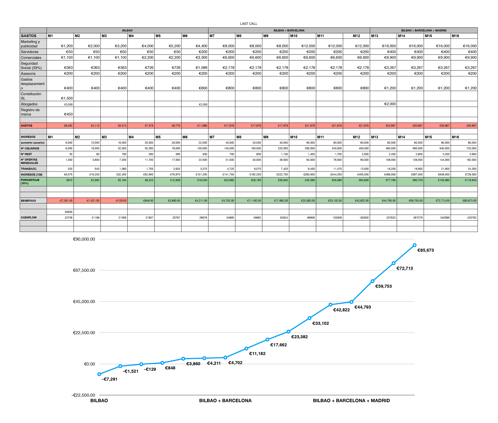

# last-call

This project was developed during the StartUp Weekend Gastronomy organized by the Basque Culinary Center. 

#### LastCall Team

- Andrea Escribano - andrea@aldra.coop
- Andrés Díaz - andres.diaz@alumni.bculinary.com
- Iñigo Martinez - inigomlap@gmail.com
- Edgar Pons -  edgarponsforn@gmail.com
- Silvia Rozas - s.rozas.fuertes@gmail.com

--------------------------------------------------------------------------------------------------------------------------------

## Project Summary

"The Last Call" proposes to attract customers to the restaurants during the hours of low affluence.
To do this, we've created an app in which restaurants auction off empty tables, and launch time-limited flash bids to cover periods of low activity.

Through this application, we helps restaurants to increase the number of customers during the hours of low affluence, creating new moments of consumption. In addition, we improve the promotion of local restaurants, and offer them information about their target customers. On the other hand, we generate new consumption ideas for users, informing them in real time of large discounts in the area.

Throughout the weekend we have been learning from the feedback of restaurants and diners, modifying our business model and polishing all the details to make this a viable project. This project has been focused on a continuous validation work and the presentation of an attractive business model.

## Startup Weekend: Gastronomy

During this event, we had the opportunity to get to know the experience and vision of professionals from different sectors: entrepreneurs, investors, developers, designers, and of course gastronomy experts.

Spanish press coverage: 

- [Gastroeconomy](https://www.gastroeconomy.com/2019/07/startup-weekend-gastronomy-de-basque-culinary-center-claves-del-emprendimiento-digital-en-gastronomia/)
- [TerritorioGastronomico](http://territoriogastronomico.com/noticias/trust-eat-ganador-del-encuentro-san-sebastian-gastronomy-startup-weekend)

## Project Deliverables

#### Customer Experience

#### Market Competitors

#### Initial Inversion

#### Advertisement

    

